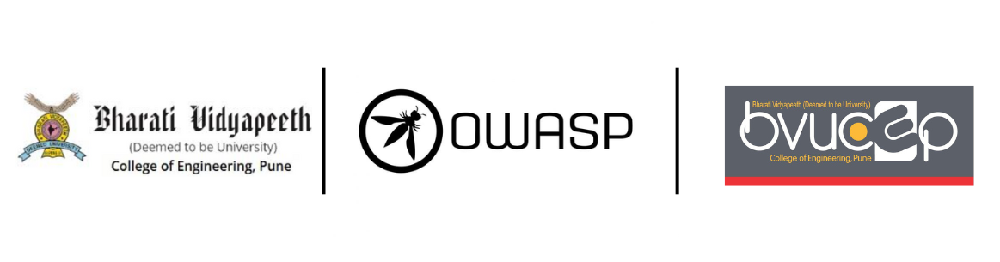

---

layout: col-sidebar
title: OWASP Bharati Vidyapeeth (Deemed to be University) College of Engineering 
tags: BVDUCOEP
region: Asia
country: India
meetup-group:

---



## Welcome
The OWASP Student Chapter at Bharati Vidyapeeth (Deemed to be University) College of Engineering,Pune (BVDUCOE) is a student-driven initiative dedicated to fostering a culture of cybersecurity awareness, research, and innovation.

Established and led by **Student Leaders Ankit and Aaditya Gautam**, under the guidance of **Faculty Advisor Prof. Gajanan V. Bhole**, the chapter aims to create a dynamic learning environment where students can explore the fundamentals and advanced concepts of web application security, ethical hacking, and secure coding practices.

As an official affiliate of the Open Web Application Security Project (OWASP), our chapter provides a platform for hands-on learning through workshops, technical talks, hackathons, Capture The Flag (CTF) competitions, and industry collaborations. We strive to bridge the gap between academia and industry by engaging students with real-world security challenges.

By bringing together a diverse group of enthusiastic learners, security professionals, and researchers, we aim to cultivate a strong cybersecurity community within our institution. Our vision is to equip students with the knowledge, skills, and ethical mindset required to combat modern cybersecurity threats and contribute meaningfully to the field.

Join us as we build a more secure digital future, one step at a time.

## Participation
The Open Worldwide Application Security Project (OWASP) is a nonprofit foundation that works to improve the security of software. All of our projects, tools, documents, forums, and chapters are free and open to anyone interested in improving application security. 

Chapters are led by local leaders in accordance with the [Chapters Policy](/www-policy/operational/chapters). Financial contributions should only be made online using the authorized online donation button. 

Everyone is welcome and encouraged to participate in our [Projects](/projects/), [Local Chapters](/chapters/), [Events](/events/), [Online Groups](https://groups.google.com/a/owasp.com/){:target='_blank'}, and [Community Slack Channel](https://owasp.slack.com/){:target='_blank'}. We especially encourage diversity in all our initiatives. OWASP is a fantastic place to learn about application security, to network, and even to build your reputation as an expert. We also encourage you to be [become a member](/membership/) or consider a [donation](/donate/) to support our ongoing work.

Next Meeting/Event <!-- You should keep this section as it will populate your meetup events -->
### Upcoming Events

We Have Lots Of Exciting Stuff Coming Up Very Soon ! Stay Tuned To Our Media Channels ... :)


## CONNECT WITH US!

Follow and Support us on

 <a href="https://www.instagram.com/owasp_bvducoep?=" target="_blank" > <span style = "font-family:sans-serif">Instagram </span> </a> <br/>
 <a href="https://www.youtube.com/channel/UC_Qd7v56QH7UKp3u9Mu6Ksg" target="_blank" >  <span style = "font-family:sans-serif">  YouTube </span></a> <br/>
---------------------



## Welcome
Include some information here about your chapter Hello

## Participation
The Open Worldwide Application Security Project (OWASP) is a nonprofit foundation that works to improve the security of software. All of our projects ,tools, documents, forums, and chapters are free and open to anyone interested in improving application security. 

Chapters are led by local leaders in accordance with the [Chapter Leader Handbook](/www-policy/rules-of-procedure/chapter-handbook). Financial contributions should only be made online using the authorized online donation button. To be a SPEAKER at ANY OWASP Chapter in the world simply review the [speaker agreement](/www-policy/speaker-agreement) and then contact the local chapter leader with details of what OWASP Project, independent research, or related software security topic you would like to present.

Everyone is welcome and encouraged to participate in our [Projects](/projects), [Local Chapters](/chapters), [Events](/events), [Online Groups](https://groups.google.com/a/owasp.com/){:target='_blank'}, and [Community Slack Channel](https://owasp.slack.com/){:target='_blank'}. We especially encourage diversity in all our initiatives. OWASP is a fantastic place to learn about application security, to network, and even to build your reputation as an expert. We also encourage you to be [become a member](/membership) or consider a [donation](/donate) to support our ongoing work.

## Next Meeting/Event
---------------------




```
{info.md}

This separate file is where you should place links to your Google Group and Meetup page. It will be automatically rendered in the column sidebar.

{leaders.md}

Another separate file that should simply include each leaders name with mailto link as a list. It will also be automatically rendered in the column sidebar.

-->
